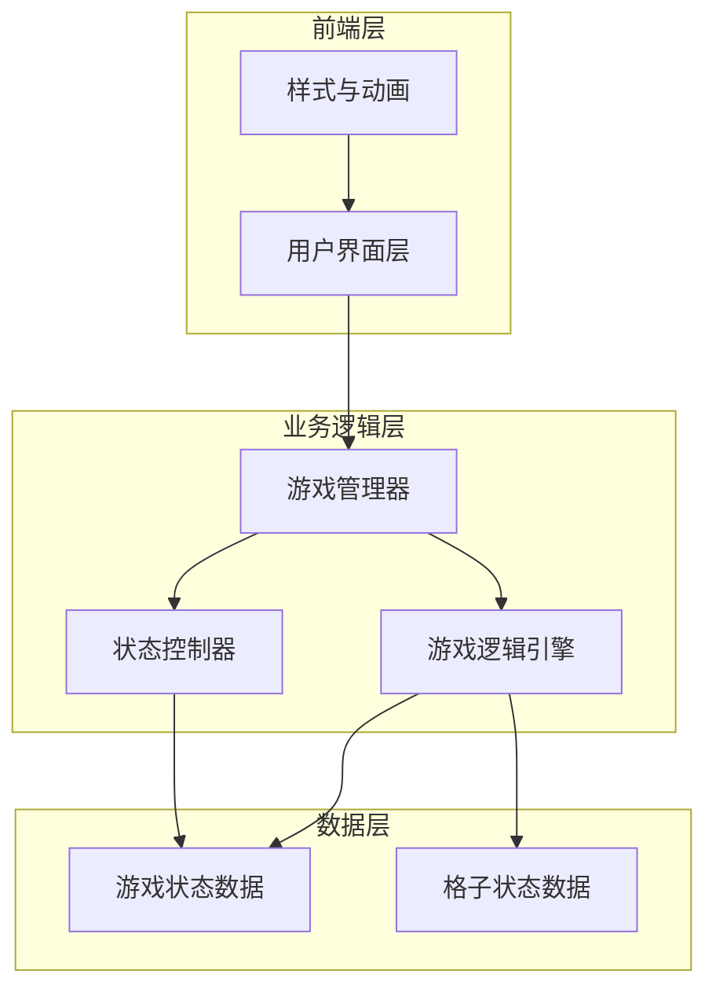

# 扫雷游戏技术架构文档

## 1. 项目架构

### 1.1 整体架构设计


### 1.2 文件结构
```
/workspace/
├── index.html          # 主页面
├── css/
│   └── style.css       # 样式文件
├── js/
│   └── game.js         # 游戏逻辑
├── .trae/
│   └── documents/
│       ├── minesweeper-prd.md
│       └── minesweeper-architecture.md
└── README.md           # 项目说明
```

## 2. 技术选型

### 2.1 前端技术栈
- **HTML5**：语义化标签构建游戏界面
- **CSS3**：
  - CSS Grid 实现游戏网格布局
  - CSS Variables 管理主题色彩
  - CSS Animations 实现动画效果
  - Flexbox 布局其他UI元素
- **JavaScript (ES6+)**：
  - 原生 JavaScript，无框架依赖
  - 模块化代码结构
  - 事件委托优化性能

### 2.2 外部资源
- **Google Fonts**：
  - Press Start 2P（像素风格字体）
  - JetBrains Mono（等宽字体）
- **无其他外部依赖**：纯原生实现

## 3. 核心模块设计

### 3.1 游戏管理器（GameManager）
**职责：**
- 管理游戏生命周期
- 协调各模块通信
- 处理用户输入分发

**公共API：**
```javascript
class GameManager {
  constructor(difficulty)
  initGame()
  handleCellClick(x, y)
  handleCellRightClick(x, y)
  resetGame()
  changeDifficulty(difficulty)
  getGameState()
}
```

### 3.2 游戏逻辑引擎（GameLogicEngine）
**职责：**
- 地雷生成与放置
- 数字计算
- 空白区域扩展
- 胜负判定

**核心算法：**
```javascript
class GameLogicEngine {
  // 地雷生成（首次点击保护）
  generateMines(firstClickX, firstClickY)
  
  // 计算相邻地雷数
  calculateAdjacentMines(x, y)
  
  // BFS空白扩展
  revealEmptyCells(x, y)
  
  // 检查胜利条件
  checkWinCondition()
  
  // 获取邻居格子
  getNeighbors(x, y)
}
```

### 3.3 状态控制器（StateController）
**职责：**
- 管理游戏状态流转
- 计时器控制
- 地雷计数器

**状态枚举：**
```javascript
const GameState = {
  READY: 'ready',      // 等待开始
  PLAYING: 'playing',  // 游戏进行中
  WON: 'won',          // 胜利
  LOST: 'lost'         // 失败
};

const CellState = {
  UNREVEALED: 0,       // 未揭示
  REVEALED: 1,         // 已揭示
  FLAGGED: 2           // 已标记
};
```

## 4. 数据结构定义

### 4.1 游戏配置
```javascript
const DIFFICULTIES = {
  beginner: { rows: 9, cols: 9, mines: 10 },
  intermediate: { rows: 16, cols: 16, mines: 40 },
  expert: { rows: 16, cols: 30, mines: 99 }
};
```

### 4.2 格子数据模型
```javascript
class Cell {
  constructor(x, y) {
    this.x = x;
    this.y = y;
    this.isMine = false;
    this.adjacentMines = 0;
    this.state = CellState.UNREVEALED;
  }
}
```

### 4.3 游戏状态数据
```javascript
class GameState {
  constructor() {
    this.grid = [];           // 格子二维数组
    this.state = GameState.READY;
    this.flagCount = 0;       // 已标记数量
    this.revealedCount = 0;  // 已揭示数量
    this.startTime = null;
    this.elapsedTime = 0;
  }
}
```

## 5. 事件处理设计

### 5.1 用户交互事件
| 事件 | 目标元素 | 处理器 | 动作 |
|------|---------|--------|------|
| 左键点击 | 格子 | handleCellClick | 揭示格子 |
| 右键点击 | 格子 | handleCellRightClick | 标记/取消标记 |
| 点击表情 | 按钮 | resetGame | 重新开始 |
| 点击难度 | 按钮 | changeDifficulty | 切换难度 |

### 5.2 事件委托策略
- 在游戏网格容器上绑定单个点击事件
- 通过 event.target.dataset 获取格子坐标
- 减少事件监听器数量，提升性能

```javascript
gridContainer.addEventListener('click', (e) => {
  const cell = e.target.closest('.cell');
  if (cell) {
    const x = parseInt(cell.dataset.x);
    const y = parseInt(cell.dataset.y);
    gameManager.handleCellClick(x, y);
  }
});
```

## 6. 渲染策略

### 6.1 DOM渲染模式
- **初始渲染**：生成完整网格DOM结构
- **增量更新**：仅更新变化的部分
- **状态类切换**：通过classList添加/移除状态类

### 6.2 动画实现
| 动画类型 | 实现方式 | 持续时间 |
|---------|---------|---------|
| 格子揭示 | CSS transform + opacity | 150ms |
| 空白扩展 | CSS transition-delay 涟漪效果 | 50ms/格 |
| 标记弹跳 | CSS animation bounce | 300ms |
| 胜利庆祝 | CSS animation rainbow + particles | 2000ms |
| 失败震动 | CSS animation shake | 500ms |

## 7. 性能优化

### 7.1 代码层面
- 事件委托减少监听器
- 避免在循环中重复查询DOM
- 使用 DocumentFragment 批量插入DOM

### 7.2 渲染层面
- CSS transform 替代 top/left 动画
- will-change 提示浏览器优化
- 避免触发布局重排的样式操作

### 7.3 算法层面
- 空白区域扩展使用 BFS 而非递归（避免栈溢出）
- 预计算邻居格子坐标
- 游戏状态变化时延迟重新渲染

## 8. 可访问性设计

### 8.1 键盘支持
- Tab 导航到游戏区域
- 方向键移动焦点格子
- Enter/Space 揭示格子
- F 键标记地雷

### 8.2 屏幕阅读器
- ARIA labels 标注按钮功能
- 游戏状态实时播报
- 格子内容语义化描述

### 8.3 色彩对比
- 所有文本符合 WCAG AA 标准
- 数字颜色不仅依赖色彩区分，附带图案/粗细区分
