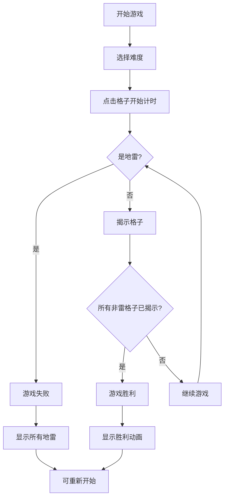
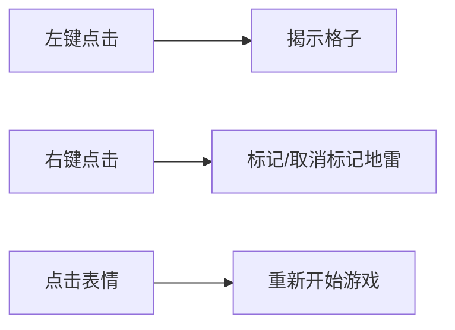

# 扫雷小游戏 PRD 文档

## 1. 产品概述

**产品名称：** 复古未来主义扫雷游戏

**一句话介绍：** 一款融合80年代街机美学与现代极简主义的网页扫雷游戏

**核心价值：**
- 经典游戏玩法的现代化演绎
- 独特的视觉风格带来沉浸式游戏体验
- 简洁直观的操作，无需学习成本

**目标用户：** 休闲游戏玩家、怀旧游戏爱好者、办公室摸鱼人群

## 2. 核心功能

### 2.1 扫雷核心机制
- **经典扫雷玩法**：点击格子揭示内容，右键标记地雷
- **难度级别**：初级（9x9, 10雷）、中级（16x16, 40雷）、高级（30x16, 99雷）
- **计时系统**：记录完成游戏所需时间
- **地雷计数器**：显示剩余未标记地雷数量

### 2.2 游戏状态管理
- **新游戏**：随时重新开始当前难度
- **游戏胜利**：揭示所有非雷格子时触发胜利动画
- **游戏失败**：点击地雷时显示所有地雷位置并触发失败动画
- **自动扫空白**：点击空白格子时自动扩展揭示相邻空白区域

### 2.3 辅助功能
- **首次点击保护**：确保第一次点击不会是地雷
- **数字颜色提示**：1-8每个数字对应不同颜色
- **表情按钮**：显示当前状态（笑脸/惊讶/胜利/失败）

## 3. 核心流程

### 3.1 游戏主流程


### 3.2 用户交互流程


## 4. UI/UX 设计

### 4.1 设计风格

**主题：复古未来主义（Retro-Futurism）**
- 融合80年代街机厅霓虹灯光与90年代Windows扫雷的经典元素
- 深色背景配合荧光色点缀
- 像素化与现代平滑动画的碰撞

**色彩方案：**
- 主背景：`#0a0a0f`（深邃夜空黑）
- 次背景：`#1a1a2e`（暗紫灰）
- 格子未揭示：`#16213e`（深海蓝）
- 格子已揭示：`#0f0f23`（暗色）
- 地雷：`#ff2e63`（霓虹红）
- 旗帜：`#08d9d6`（青色）
- 数字颜色：
  - 1: `#00ff88`（荧光绿）
  - 2: `#00b4d8`（电光蓝）
  - 3: `#ff6b6b`（珊瑚红）
  - 4: `#9b5de5`（电紫）
  - 5: `#f72585`（品红）
  - 6: `#4cc9f0`（天蓝）
  - 7: `#ffffff`（纯白）
  - 8: `#6c757d`（灰色）

**字体：**
- 主字体：`Press Start 2P`（像素风格）- 用于标题和数字
- 辅助字体：`JetBrains Mono` - 用于UI文字

**按钮风格：**
- 扁平化设计配合霓虹光晕效果
- hover时产生微光扫过动画
- 点击时有按压反馈效果

### 4.2 布局设计

**整体布局：**
```
┌─────────────────────────────────┐
│         标题：MINESWEEPER        │
├─────────────────────────────────┤
│    [雷数显示]  [表情按钮]  [计时] │
├─────────────────────────────────┤
│                                 │
│         游戏网格区域              │
│                                 │
└─────────────────────────────────┘
│       难度选择按钮组              │
└─────────────────────────────────┘
```

**格子设计：**
- 尺寸：32x32 像素
- 边框：2px 像素风格边框
- 状态：未揭示、已揭示、已标记、已按下
- 角落：轻微圆角（4px）保持像素感

### 4.3 动画效果

- **格子揭示**：轻微缩放 + 淡入效果
- **空白扩展**：涟漪式扩散动画
- **标记旗帜**：弹跳效果
- **胜利动画**：彩虹渐变 + 粒子庆祝效果
- **失败动画**：地雷闪烁 + 震动效果
- **数字出现**：打字机式快速显示

### 4.4 响应式设计

- **桌面优先**：优化 1024px+ 屏幕
- **平板适配**：保持格子尺寸，缩放整体布局
- **移动端**：
  - 触摸操作支持（长按标记）
  - 缩小格子至 28x28 像素
  - 简化UI层级

## 5. 技术实现方案

### 5.1 技术栈
- **纯 HTML5 + CSS3 + JavaScript**：无框架依赖
- **Google Fonts**：Press Start 2P、JetBrains Mono
- **本地存储**：保存最高记录（可选功能）

### 5.2 游戏网格数据结构
```javascript
// 格子状态枚举
const CellState = {
  UNREVEALED: 'unrevealed',
  REVEALED: 'revealed',
  FLAGGED: 'flagged'
};

// 游戏状态
const GameState = {
  READY: 'ready',
  PLAYING: 'playing',
  WON: 'won',
  LOST: 'lost'
};
```

### 5.3 核心算法
1. **地雷随机生成**：Fisher-Yates 洗牌算法
2. **数字计算**：遍历相邻8个格子统计地雷数
3. **空白扩展**：BFS 广度优先搜索
4. **首次点击保护**：生成地雷时排除首次点击及其邻居

## 6. 验收标准

### 6.1 功能验收
- [ ] 三种难度级别均可正常游戏
- [ ] 左键点击正确揭示格子
- [ ] 右键点击正确标记/取消标记
- [ ] 空白格子自动扩展功能正常
- [ ] 首次点击不会是地雷
- [ ] 胜利条件正确判断
- [ ] 失败条件正确判断并显示所有地雷
- [ ] 计时器准确计时
- [ ] 地雷计数器准确显示剩余数量

### 6.2 视觉验收
- [ ] 复古未来主义风格统一
- [ ] 所有动画流畅无卡顿
- [ ] 响应式布局在各种屏幕尺寸下正常显示
- [ ] 数字颜色清晰可辨
- [ ] 游戏状态切换有视觉反馈

### 6.3 交互验收
- [ ] 所有按钮可正常点击
- [ ] 难度切换即时响应
- [ ] 游戏结束后可立即重新开始
- [ ] 移动端触摸操作流畅
